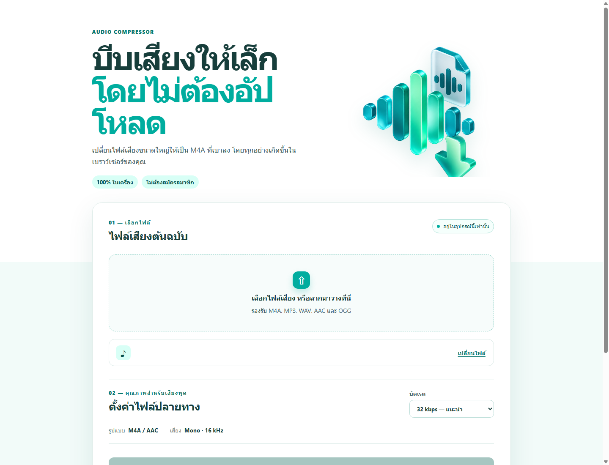

# บีบเสียง

เว็บเครื่องมือเสียง 3 หน้า: บีบอัดเสียง, แบ่งไฟล์เสียงแบบ local-first และถอดเสียงด้วย Google Gemini สำหรับไฟล์ขนาดเล็ก โดยไม่มีฐานข้อมูลหรือพื้นที่เก็บไฟล์ของแอป

## ลองใช้งาน

<https://compress-audio-local-nisio.netlify.app/>



## เครื่องมือในเว็บ

### บีบเสียง

เลือกไฟล์ M4A, MP3, WAV, AAC หรือ OGG แล้วสร้าง M4A/AAC ที่เล็กลงในเบราว์เซอร์โดยตรง ไม่มีการอัปโหลดไฟล์

### แบ่งไฟล์เสียง

หน้า [`/split/`](https://compress-audio-local-nisio.netlify.app/split/) ให้เลือกจำนวนส่วน 2–50 ไฟล์ ระบบจะแบ่งไฟล์ตามเวลาให้ใกล้เคียงกันและให้ดาวน์โหลดแต่ละส่วนได้ทันที เหมาะสำหรับแบ่งไฟล์ให้ต่ำกว่า 4 MB ก่อนนำไปถอดเสียง

- ไม่อัปโหลดไฟล์ และไม่มีการลดคุณภาพเพิ่ม เพราะใช้ codec เดิมของไฟล์ต้นฉบับ
- หน้าเว็บจะแสดงขนาดโดยประมาณต่อส่วน เพื่อเลือกจำนวนไฟล์ได้ง่าย

### ถอดเสียงด้วย AI

หน้า [`/transcribe/`](https://compress-audio-local-nisio.netlify.app/transcribe/) ส่งไฟล์เสียงไปยัง Google Gemini ผ่าน Netlify Function เพื่อคืนข้อความถอดเสียง พร้อมคัดลอกหรือดาวน์โหลดเป็น Markdown

- จำกัดไฟล์ที่ **4 MB** ทั้งที่หน้าเว็บและฝั่งฟังก์ชัน เพื่ออยู่ในขอบเขต payload ของ Netlify
- แอปไม่มีฐานข้อมูลและไม่เก็บไฟล์เสียง แต่ไฟล์จะถูกส่งไปยัง Google Gemini เพื่อประมวลผล จึงไม่ใช่โหมด local-only
- จำกัดการเรียก API 3 ครั้งต่อนาทีต่อ IP เพื่อลดการใช้โควตาโดยไม่ตั้งใจ

## จุดเด่น

- ไฟล์เสียงไม่ถูกอัปโหลดไปยัง Netlify หรือเซิร์ฟเวอร์ใด ๆ
- สร้างไฟล์ M4A/AAC แบบ mono 16 kHz เพื่อให้ไฟล์เสียงพูดมีขนาดเล็กลง
- เลือกบิตเรต 24, 32 หรือ 48 kbps ได้
- ใช้ได้กับไฟล์ขนาดใหญ่บน Chrome และ Edge รุ่นปัจจุบัน
- ไม่มีบัญชีผู้ใช้ ไม่มีประวัติ และไม่มีข้อมูลค้างบนระบบ

## วิธีใช้

1. เปิดเว็บและเลือกไฟล์เสียง หรือลากไฟล์มาวาง
2. เลือกบิตเรต: 32 kbps เป็นค่าที่เหมาะกับเสียงพูดทั่วไป
3. กด **บีบอัดไฟล์เสียง**
4. ดาวน์โหลดไฟล์ M4A ที่ได้เมื่อการประมวลผลเสร็จ

ครั้งแรก เบราว์เซอร์จะดาวน์โหลดตัวเข้ารหัส WebAssembly ประมาณ 31 MB และเก็บไว้ในแคชของเบราว์เซอร์ การบีบอัดไฟล์เกิดขึ้นบนอุปกรณ์ของผู้ใช้ทั้งหมด

## Deploy บน Netlify

### Netlify Drop

ใช้ไฟล์ `audio-compressor-netlify-drop.zip` ซึ่งมีไฟล์เว็บไซต์อยู่ที่ระดับบนสุด แล้วลากขึ้นหน้า Deploys ของ Netlify

### เชื่อมต่อ Git repository

1. Push โฟลเดอร์นี้ขึ้น GitHub
2. สร้างไซต์ใหม่จาก repository ใน Netlify
3. ใน **Project configuration → Environment variables** เพิ่มตัวแปรชื่อ `GEMINI_API_KEY` แล้วใส่ Google AI Studio API key (ห้ามใส่คีย์ไว้ในไฟล์หรือฝั่งเบราว์เซอร์)
4. Netlify จะอ่าน `netlify.toml` เผยแพร่โฟลเดอร์ `dist` และ deploy ฟังก์ชันถอดเสียงอัตโนมัติ

> หน้า `/transcribe/` ต้อง deploy ผ่าน Git repository เพื่อให้ Netlify Function ทำงาน; Netlify Drop ใช้ได้เฉพาะตัวบีบเสียงแบบ static

## โครงสร้างโปรเจกต์

```text
dist/
  index.html              หน้าเว็บ
  app.js                  การเลือกไฟล์และสั่งบีบอัด
  ffmpeg-worker.js        Web Worker สำหรับตัวเข้ารหัส
  split/                  หน้าแบ่งไฟล์เสียงในเบราว์เซอร์
  transcribe/             หน้าถอดเสียงและโค้ดฝั่งเบราว์เซอร์
  assets/
    audio-compression-hero.png
    favicon.png
docs/
  ui-preview.png          ภาพหน้าจอสำหรับ README
netlify/
  functions/transcribe.mjs  ตัวกลางที่เก็บ Gemini API key ไว้ฝั่งเซิร์ฟเวอร์
```

## ข้อควรรู้

- ไฟล์ขนาดใหญ่ใช้หน่วยความจำของเบราว์เซอร์มากกว่าปกติ ควรปิดแท็บหรือแอปอื่นหากเครื่องช้า
- หากรีเฟรชหรือปิดหน้าเว็บขณะทำงาน ต้องเริ่มใหม่ เพราะไม่มีการเก็บไฟล์หรือสถานะบนเซิร์ฟเวอร์
- API key ต้องเก็บใน Netlify Environment Variables เท่านั้น และควรสร้าง key ใหม่หากเคยส่งคีย์ผ่านแชตหรือเผยแพร่ในที่สาธารณะ
